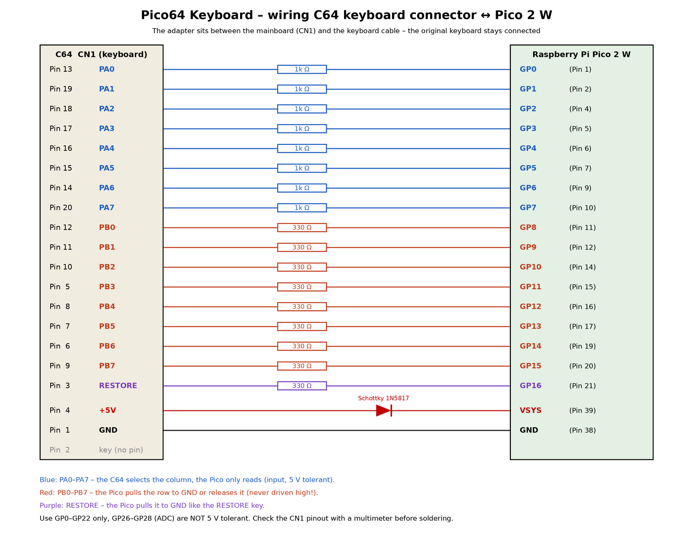

# Pico64 Keyboard

*Deutsche Fassung: [README.de.md](README.de.md)*

A tiny adapter that turns a **Raspberry Pi Pico 2 W** into a wireless keyboard for the
**Commodore 64** – controlled from your phone with the
[Blue-64 Keyboard app](https://github.com/do2mad/blue64-keyboard-ios) (iPhone and Android).

The Pico plugs in between the C64 mainboard and the keyboard cable and emulates the keyboard
matrix in software. Apart from the Pico you only need **17 resistors and one diode** – no level
shifters and no crosspoint switch, because GPIO 0–25 of the RP2350 are 5 V tolerant.
The original keyboard and both joysticks keep working.

## Features

- Emulates the complete 8×8 keyboard matrix plus RESTORE – any number of keys at the same time
- Reacts within about 70 ns to every column the C64 selects (core 1 runs a lookup table from RAM),
  so programs that scan several columns at once work too
- Same Bluetooth LE service as the BT-64 / Blue-64 firmware with the BLE keyboard service –
  the Blue-64 Keyboard app works unchanged (the Pico shows up as **Pico64**)
- Type text and short BASIC listings from the app (snippets)
- USB console: every line you type in a terminal is typed on the C64, plus a key log for debugging
- Powered by the C64, no extra power supply

## Status

**v0.9.0 – working prototype.** Built on perfboard and tested on a breadbin C64 with an
iPhone and an Android phone. A KiCad PCB is in progress (see [hardware/](hardware/)).

## Getting started

1. **Build the adapter** – wiring, parts list and safety notes: [docs/HARDWARE.md](docs/HARDWARE.md).
   Check the CN1 pinout of your C64 with a multimeter before soldering.
2. **Flash the firmware** – hold BOOTSEL, plug the Pico into your computer, drag
   `pico64-keyboard-vX.Y.Z.uf2` from the [latest release](https://github.com/do2mad/pico64-keyboard/releases/latest)
   onto the `RP2350` drive. Do this with the Pico **out of the C64** or with the C64 switched off.
3. **Plug it in** between CN1 and the keyboard cable, switch the C64 on – the Pico LED blinks
   (waiting for the app).
4. **Connect with the app** – [Blue-64 Keyboard](https://github.com/do2mad/blue64-keyboard-ios)
   finds the Pico by itself, the LED stays on while connected.

Building the firmware yourself: [docs/BUILDING.md](docs/BUILDING.md).
Bluetooth protocol: [docs/PROTOCOL.md](docs/PROTOCOL.md).

## USB console

Connect the Pico via USB while it sits in the C64 (the diode protects both sides) and open a
terminal with 115200 baud, e.g. `screen /dev/tty.usbmodem* 115200` on a Mac.

- Every line you type is typed on the C64, followed by RETURN (letters unshifted, tokens like
  `~clr~`, `~home~`, `~f1~` work).
- A line with just `d` switches the key log on or off: every key state received via Bluetooth
  and every state applied to the matrix, with timestamps, plus the connection interval.

## Safety

- The Pico **never drives a C64 line high** – PB0–PB7 and RESTORE are pulled to GND or released
  (open drain), PA0–PA7 are only read.
- Use GP0–GP22 only. GP26–GP28 are **not** 5 V tolerant, GP23–25 and GP29 belong to the radio.
- 5 V tolerance only applies while the Pico is powered – which it always is, because it is
  powered by the C64.
- Use at your own risk. Check your wiring twice.

## Credits & license

- Firmware © 2026 Martin Oswald (do2mad) – [1mhz.de](https://1mhz.de), [MIT License](LICENSE)
- Hardware (schematic, PCB) © 2026 Martin Oswald,
  [CC BY-NC-SA 4.0](LICENSE-HARDWARE.md) – non-commercial use
- Uses the Raspberry Pi Pico SDK, BTstack and the CYW43 driver – see [NOTICE](NOTICE)
- The Bluetooth service follows the protocol of the BLE keyboard extension for
  [BT-64 / Blue-64](https://github.com/sideprojectslab/BT-64) by SideProjectsLab
- C64 keyboard connector pinout after Ruud Baltissen

Changes: [CHANGELOG.md](CHANGELOG.md)

Commodore and Commodore 64 are trademarks of their respective owners. This project is not
affiliated with or endorsed by them, by Raspberry Pi Ltd. or by SideProjectsLab.
